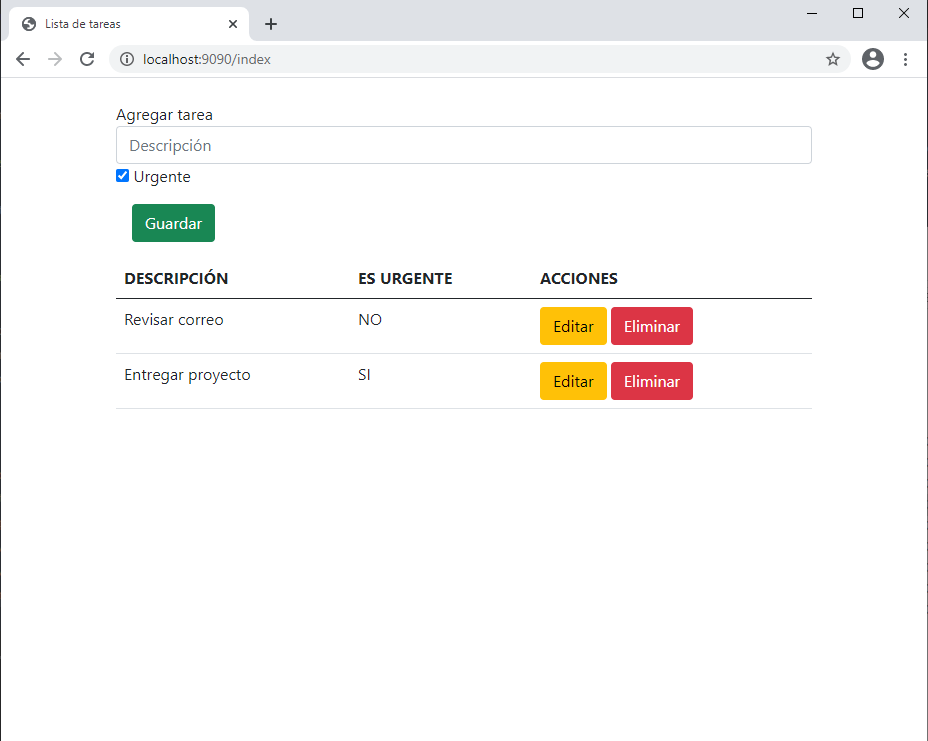
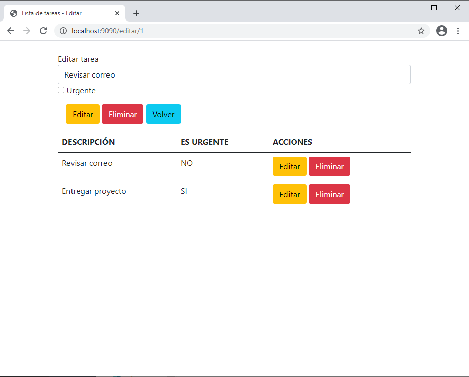
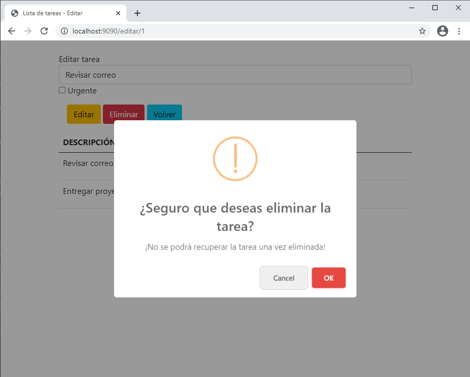
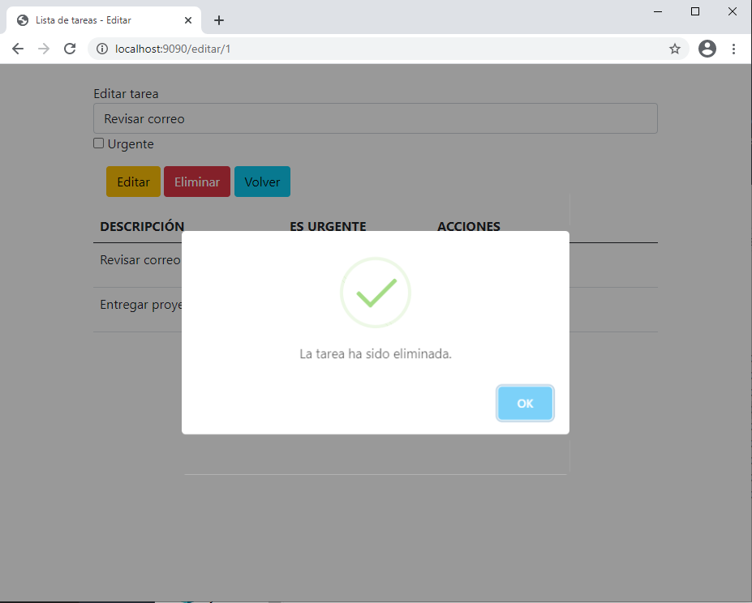

# Lista de tareas

Pequeña aplicación de una lista de tareas realizada con Spring Boot. Se pueden agregar tareas, indicando si es una tarea
urgente o no, también es posbile editarlas o eliminarlas de la lista.

### Imágenes 📷

### Pre-requisitos 📋

* Java Runtime Environment
* Navegador web

### Instalación 🔧

* Ejecutar el archivo lista-tareas-crud-spring-0.0.1-SNAPSHOT.jar ubicado en el directorio raíz.
* Abrir la dirección http://localhost:9090 desde el navegador.
* La base de datos se guardará en un fichero llamado db_lista_tareas en el directorio del usuario (C:\Users\*usuario*).
* Se puede acceder al gestor de la base de datos desde la dirección http://localhost:9090/h2-console.
* La ejecución se puede detener finalizando la tarea javax.exe desde la pestaña detalles del administrador de tareas.

## Construido con 🛠️

* [Java](https://docs.oracle.com/javase/8/docs/api/)
* [Spring Boot](https://docs.spring.io/spring-boot/docs/current/reference/htmlsingle/)
* [Thymeleaf](https://www.thymeleaf.org/documentation.html)
* [H2](https://www.h2database.com)
* [HTML5](https://developer.mozilla.org/es/docs/HTML/HTML5)
* [Bootstrap](https://getbootstrap.com/docs/5.0/getting-started/introduction/)
* [JavaScript](https://developer.mozilla.org/es/docs/Web/JavaScript)
* [JQuery](https://api.jquery.com/)

---
[Cristian Guerrero Guijosa](https://github.com/cristianguerrerodev)
